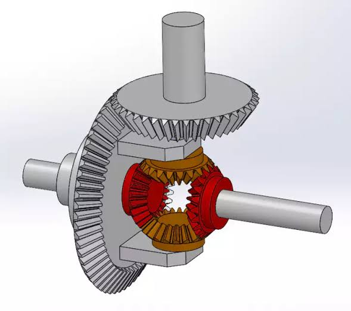
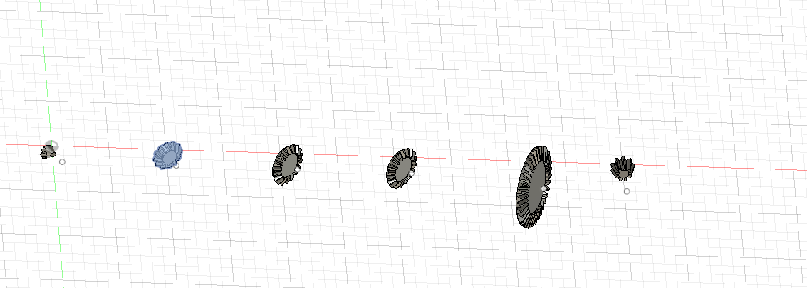

# Differential Gear Generator

> A **Fusion 360 Add-In** that generates a complete involute bevel-gear differential assembly — Ring Gear, Drive Pinion, Spider Gears, and Side Gears — with a single dialog.

<p align="center">
  
</p>

---

## Generated Output

<p align="center">
  
</p>

*6-piece differential: SideGear_R · SideGear_L · SpiderGear_1 · SpiderGear_2 · RingGear · DrivePinion*

---

## Features

| Component | Role | Axis (Assembled mode) |
|---|---|---|
| **SideGear_R** | Right axle output (N_right) | +Z |
| **SideGear_L** | Left axle output (N_left) | −Z |
| **SpiderGear_1** | Cross-pin planet gear | +X |
| **SpiderGear_2** | Cross-pin planet gear | −X |
| **RingGear** *(optional)* | Crown wheel — driven by pinion | +Z (large, wraps around side gears) |
| **DrivePinion** *(optional)* | Motor shaft input | +Y |

- All gears use **involute 90° bevel** profiles (GFGearGenerator NC8 core)  
- **Assembled mode** — all cone apices at world origin, correct differential geometry  
- **Exploded mode** — parts spaced along X axis for inspection / export  
- Metric module or custom tooth counts  
- Optional shaft bore holes  
- 2 or 4 spider gears  

---

## Installation

1. Copy the `DifferentialGearGenerator` folder to:
   ```
   %APPDATA%\Autodesk\Autodesk Fusion 360\API\AddIns\
   ```
2. In Fusion 360 → **Utilities → ADD-INS → Add-Ins** tab
3. Click **+** → browse to the folder → check **Run on Startup** → click **Run**
4. The **"DIFFERENTIAL GEAR"** panel appears in the UTILITIES toolbar

---

## Usage

1. Click the **Differential Gear Generator** button in the toolbar
2. Set parameters in the dialog:

| Parameter | Description | Default |
|---|---|---|
| Module [mm] | Gear module | 2 mm |
| Side Gear z1 | Side gear tooth count | 18 |
| Spider Gear z2 | Spider gear tooth count | 12 |
| Pressure Angle | Involute pressure angle | 20° |
| Spider Count | 2 or 4 spider gears | 2 |
| Shaft Bore | Bore diameter (0 = none) | 0 mm |
| Fast Compute | Fewer spline points (faster) | ✓ |
| Layout Mode | Assembled / Exploded | Assembled |
| Ring Gear z | Crown wheel tooth count | 36 |
| Drive Pinion z | Input pinion tooth count | 9 |

3. Click **OK** — Fusion generates all components

---

## Assembled Mode — Coordinate System

```
              +Y  (DrivePinion — motor shaft)
               ↑
               │
  −Z ←──[SideL]──[CENTER]──[SideR]──→ +Z   (axle axis)
               │
    [Spider1 +X]    [Spider2 −X]
               │
         [RingGear +Z, large — wraps around side gears]
```

All cone apices coincide at `(0, 0, 0)`.  
Use **Fusion 360 → Assemble → Joint** to add motion constraints.

---

## Folder Structure

```
DifferentialGearGenerator/
├── DifferentialGearGenerator.py        Main add-in code
├── DifferentialGearGenerator.manifest  Add-in metadata (type: addin)
├── generated.png                       Example output image
└── resources/
    ├── icon.jpeg                       Original icon source
    ├── 16x16.png                       Toolbar icon (16 px)
    ├── 32x32.png                       Toolbar icon (32 px)
    └── 64x64.png                       Toolbar icon (64 px)
```

---

## Math Background

| Formula | Description |
|---|---|
| $\delta_1 = \arctan(z_1 / z_2)$ | Side gear pitch cone angle |
| $\delta_2 = 90° - \delta_1$ | Spider gear pitch cone angle |
| $A_o = \frac{m\sqrt{z_1^2+z_2^2}}{2}$ | Outer cone distance |
| $b = A_o / 3$ | Face width (industry standard) |

Gear profiles use the **Tredgold back-cone approximation** — identical to the GFGearGenerator NC8 bevel implementation.

---

## Core Source Credit

Bevel gear math and Fusion 360 API patterns ported from  
**GFGearGenerator** by Juan Gras, Michael Truell, Mervill — [included in Fusion 360 Scripts]

---

## License

MIT — free to use, modify, and distribute.
